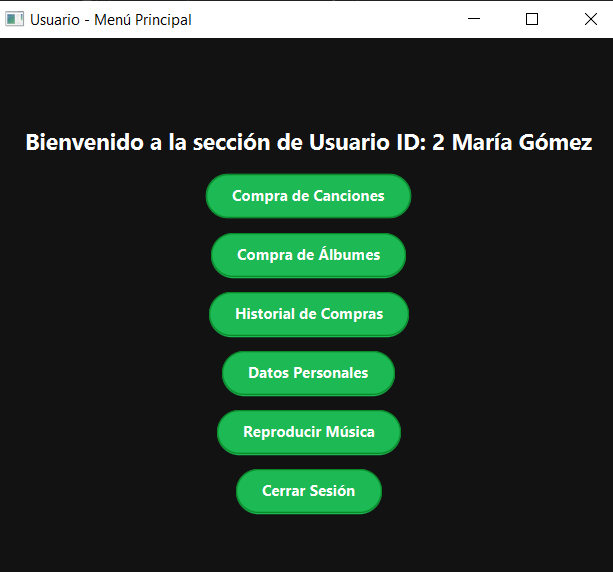
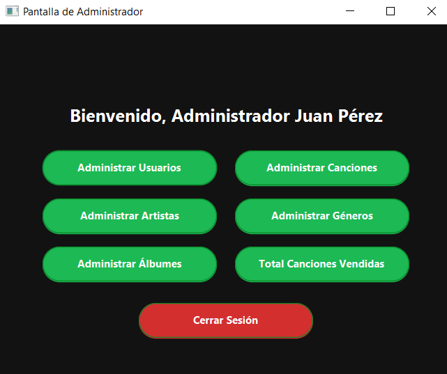

# 🎧 Aplicación Tipo Spotify – Proyecto Final

Aplicación de escritorio desarrollada en JavaFX que simula una plataforma musical similar a Spotify. Permite a los usuarios registrarse, comprar canciones o álbumes, reproducir música, y a los administradores gestionar contenido y generar reportes.

---

## 📌 Tecnologías Utilizadas

- **Lenguaje:** java 21.0.6 
- **Framework de UI:** JavaFX + CSS
- **Base de Datos:** MySQL
- **Patrones de diseño:** MVC, Singleton, Factory Method, Repository
- **Etcetera.....**
---

## 🧾 Funcionalidades Principales

### 👤 Usuario
- Registro y autenticación con contraseña encriptada (SHA-1).
- Compra de canciones individuales y álbumes completos.
- Reproducción de canciones adquiridas mediante JavaFX MediaPlayer.
- Gestión de datos personales.
- Visualización de historial de compras.
- Exportación de historial a PDF.



---

### 🔧 Administrador
- Gestión de usuarios, canciones, géneros, artistas y álbumes.
- Asignación de canciones a álbumes.
- Visualización de estadísticas de ventas.
- Generación de reportes detallados por canción.
- Exportación de reportes a PDF/CSV.




---

## 🗂️ Estructura del Proyecto

```
📦 Spotify
┣ 
┗ 📂 Proyecto Raíz
  ┣ 📂 java/
  ┃ ┣ 📄 module-info.java                    # 🔧 Configuración de módulos Java
  ┃ ┗ 📂 org/example/parcial2/
  ┃   ┣ 🚀 HelloApplication.java             # 🎯 Clase principal de la aplicación
  ┃   ┣ 🎮 HelloController.java              # 🎛️ Controlador principal
  ┃   ┃
  ┃   ┣ 📂 controller/                       # 🎯 Capa de Control (MVC)
  ┃   ┃ ┣ 💿 AlbumController.java            # 🎵 Gestión de álbumes
  ┃   ┃ ┣ 🎤 ArtistaController.java          # 👨‍🎤 Gestión de artistas
  ┃   ┃ ┣ 🎶 CancionController.java          # 🎼 Gestión de canciones
  ┃   ┃ ┣ 🧾 DetalleVentaController.java     # 📋 Detalles de ventas
  ┃   ┃ ┣ 🎭 GeneroController.java           # 🏷️ Gestión de géneros
  ┃   ┃ ┣ 👤 UserController.java             # 🔐 Gestión de usuarios
  ┃   ┃ ┗ 💰 VentaController.java            # 🛒 Gestión de ventas
  ┃   ┃
  ┃   ┣ 📂 factory/                          # 🏭 Patrón Factory Method
  ┃   ┃ ┣ 🏗️ AlbumFactory.java              # ⚙️ Factory de álbumes
  ┃   ┃ ┣ 🏗️ ArtistaFactory.java            # ⚙️ Factory de artistas
  ┃   ┃ ┣ 🏗️ CancionFactory.java            # ⚙️ Factory de canciones
  ┃   ┃ ┣ 🏗️ GeneroFactory.java             # ⚙️ Factory de géneros
  ┃   ┃ ┗ 🏗️ UserFactory.java               # ⚙️ Factory de usuarios
  ┃   ┃
  ┃   ┣ 📂 models/                           # 📊 Modelos de Datos (Entities)
  ┃   ┃ ┣ 💿 Album.java                      # 🎵 Modelo Álbum
  ┃   ┃ ┣ 🔗 AlbumCancion.java              # 🎼 Modelo Álbum-Canción
  ┃   ┃ ┣ 🎤 Artista.java                    # 👨‍🎤 Modelo Artista
  ┃   ┃ ┣ 🎶 Cancion.java                    # 🎵 Modelo Canción
  ┃   ┃ ┣ 🧾 DetalleVenta.java              # 📋 Modelo Detalle de Venta
  ┃   ┃ ┣ 🎭 Genero.java                     # 🏷️ Modelo Género
  ┃   ┃ ┣ 🎼 Interpretacion.java             # 🤝 Modelo Artista-Canción
  ┃   ┃ ┣ 👤 User.java                       # 🔐 Modelo Usuario
  ┃   ┃ ┗ 💰 Venta.java                      # 🛒 Modelo Venta
  ┃   ┃
  ┃   ┣ 📂 repository/                       # 🗄️ Capa de Acceso a Datos (DAO)
  ┃   ┃ ┣ 💿 AlbumRepository.java            # 🔍 Repository de álbumes
  ┃   ┃ ┣ 🎤 ArtistaRepository.java          # 🔍 Repository de artistas
  ┃   ┃ ┣ 🎶 CancionRepository.java          # 🔍 Repository de canciones
  ┃   ┃ ┣ 🧾 DetalleVentaRepository.java     # 🔍 Repository detalles de venta
  ┃   ┃ ┣ 🎭 GeneroRepository.java           # 🔍 Repository de géneros
  ┃   ┃ ┣ 📋 Repository.java                 # 🏗️ Interfaz base Repository
  ┃   ┃ ┣ 👤 UserRepository.java             # 🔍 Repository de usuarios
  ┃   ┃ ┗ 💰 VentaRepository.java            # 🔍 Repository de ventas
  ┃   ┃
  ┃   ┣
  ┃   ┃
  ┃   ┣ 📂 utils/                            # 🛠️ Utilidades del Sistema
  ┃   ┃ ┣ 🔌 ConnectionTest.java             # ⚡ Pruebas de conexión BD
  ┃   ┃ ┣ 🗄️ Database.java                   # 🔗 BD
  ┃   ┃ ┗ 🔐 PasswordUtils.java              # 🛡️ Encriptación
  ┃   ┃
  ┃   ┗ 📂 views/                            # 🖼️ Capa de Presentación (UI)
  ┃     ┣ ✨ AnimationUtils.java              # 🎭 Utilidades de animación
  ┃     ┣ 🔑 LoginScreen.java                # 🚪 Pantalla de inicio de sesión
  ┃     ┣ 📝 RegisterScreen.java             # ✍️ Pantalla de registro
  ┃     ┣ 🎵 ReproductorScreen.java          # 🎧 Pantalla del reproductor
  ┃     ┃
  ┃     ┣ 📂 admin/                          # 👨‍💼 Interfaces Administrativas
  ┃     ┃ ┣ 🔗 AdminAlbumCancionScreen.java  # 🎼 Asignación álbum-canción
  ┃     ┃ ┣ 💿 AdminAlbumesScreen.java       # 📀 Gestión de álbumes
  ┃     ┃ ┣ 🎤 AdminArtistasScreen.java      # 👨‍🎤 Gestión de artistas
  ┃     ┃ ┣ 🎶 AdminCancionesScreen.java     # 🎵 Gestión de canciones
  ┃     ┃ ┣ 🎭 AdminGenerosScreen.java       # 🏷️ Gestión de géneros
  ┃     ┃ ┣ 🏠 AdminScreen.java              # 🎛️ Panel principal admin
  ┃     ┃ ┣ 📊 AdminTotalCancionesVendidas.java # 📈 Estadísticas de ventas
  ┃     ┃ ┗ 👥 AdminUsuariosScreen.java      # 🔐 Gestión de usuarios
  ┃     ┃
  ┃     ┗ 📂 users/                          # 👤 Interfaces de Usuario
  ┃       ┣ 💿 UserAlbumScreen.java          # 🎵 Explorar álbumes
  ┃       ┣ 🎶 UserCancionScreen.java        # 🎼 Explorar canciones
  ┃       ┣ ⚙️ UserDatosScreen.java          # 📋 Datos personales
  ┃       ┣ 🧾 UserHistorialScreen.java      # 📚 Historial de compras
  ┃       ┣ 🎧 UserReproducirScreen.java     # 🎵 Reproductor de usuario
  ┃       ┗ 🏠 UserScreen.java               # 🎯 Panel principal usuario
  ┃
  ┗ 📂 resources/                            # 🎨 Recursos y Assets
    ┣ 🎨 Logina.css                          # 💄 Estilos de login
    ┣ 🎵 reproductor.css                     # 💄 Estilos del reproductor
    ┣ 🖼️ Spotify.png                         # 🏷️ Logo PNG
    ┣ 🖼️ Spotify.svg                         # 🏷️ Logo SVG
    ┣ 💄 styles.css                          # 🎨 Estilos globales
    ┗ 📂 org/example/parcial2/
      ┣ 🎨 estilo.css                        # 💄 Estilos principales
      ┣ 📋 hello-view.fxml                   # 🖼️ Layout principal FXML
      ┗ 📂 portadas/                         # 🖼️ Imágenes de Portadas
        ┣ 🎵 portada1.jpg                    # 🖼️ Portada álbum 1
        ┣ 🎵 portada2.jpeg                   # 🖼️ Portada álbum 2
        ┣ 🎵 portada3.jpeg                   # 🖼️ Portada álbum 3
        ┣ 🎵 portada4.jpeg                   # 🖼️ Portada álbum 4
        ┣ 🎵 portada5.jpeg                   # 🖼️ Portada álbum 5
        ┗ 🎵 portadaa.jpeg                   # 🖼️ Portada adicional
```

---

---


---

## 📄 Créditos

**Materia:** Tópicos Avanzados de Programación  
**Institución:** Instituto Tecnológico de Celaya  
**Docente:** Oscar Grimaldo Aguayo  
**Autor:** Brian Garca Mares  
**Repositorio:** [GitHub Oficial](https://github.com/GarciaMares2025/TAP/tree/master/parcial2/src/main/resources)

---

🏗️ Patrones de Diseño:

🎯 MVC (Model-View-Controller) - Separación de responsabilidades
🔄 Singleton - Gestión de conexiones de BD
🏭 Factory Method - Creación de objetos
📦 Repository - Abstracción de acceso a datos
Etcetera.....
